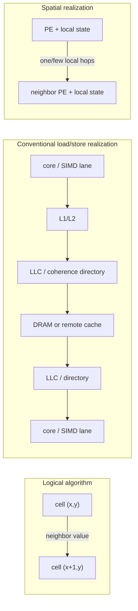

# Algorithms Whose Natural Computational Geometry Favors Cellular Media

## Executive summary

**Yes. There is a substantial and technically coherent class of algorithms whose dependency structure is so spatially local, fine-grained, and persistent that mapping them onto a conventional load/store hierarchy can impose costs that are not intrinsic to the algorithm.** The strongest examples are cellular automata, fixed-radius stencil and lattice PDE updates, lattice-gas/Lattice-Boltzmann methods, nearest-neighbor spin systems, and reaction–diffusion systems. Their defining computation is not “take a large array out of memory, process it, and put it back”; it is closer to “leave state where it is, repeatedly interact with a few nearby states.” Machines such as CAM-8, FPGA spatial pipelines, mesh-connected wafer-scale processors, cellular neural networks, and some physical chemical systems embody that geometry directly. citeturn24search2turn17view2turn16view1turn19search11turn20search12

The key distinction is between an algorithm's **logical dependency graph** and a machine's **physical communication graph**. For an ideal cellular algorithm, the logical graph has bounded degree, short-range edges, low-dimensional spatial structure, and usually persistent state at each vertex. A matching cellular medium assigns nearby logical vertices to nearby physical processors or physical sites, so one logical neighbor interaction becomes one local transfer. A conventional processor instead time-multiplexes many logical sites through a smaller number of cores, often converting those local logical edges into traffic through registers, caches, coherence directories, DRAM, kernel boundaries, MPI halos, or synchronization mechanisms. Stencil literature explicitly identifies bandwidth as the limiting resource on conventional processors, while communication lower bounds establish that distributed-memory stencil evaluation cannot make communication disappear merely through implementation cleverness. citeturn25search5turn18search2

The effect can be dramatic. A 25-point finite-difference seismic stencil mapped across the processing-element mesh of Cerebras's WSE-2 achieved a reported **228× device-side speedup over a tuned NVIDIA A100 kernel** at the largest tested grid, with more than 98% weak-scaling efficiency; the authors attributed this to low-latency communication and local memories. A 2026 WSE-3 stencil study reports up to **342× over an adapted single-precision A100 implementation**. These are specialized comparisons, not universal GPU-vs-spatial ratios, but they demonstrate that moving persistent lattice state from off-chip memory into distributed local SRAM can qualitatively change the bottleneck from memory-bound toward compute-bound. citeturn16view1turn26search1

Comparable evidence exists elsewhere. A Conway's Game of Life FPGA implementation reported **36.7× over an optimized GeForce Titan X implementation** and 2,908× over one software implementation, although the hardware generations and implementations make those ratios unsuitable as universal speedup estimates. A nearest-neighbor two-dimensional Ising Monte Carlo FPGA implementation reported nearly **10⁴× over its standard CPU baseline**. IBM reported approximately **100× lower time-to-solution and 100,000× lower energy-to-solution** for particular TrueNorth neurosynaptic workloads relative to its optimized software realization. citeturn17view0turn17view1turn22search2turn26search2

At the same time, the strongest version of the thesis—“CPUs and GPUs are intrinsically bad at cellular algorithms”—is false. **GPUs are already partially spatial machines**, with enormous parallelism, explicitly managed on-chip memories, coalesced bandwidth, and synchronization within thread blocks. Modern Lattice-Boltzmann implementations have reached up to 99% of measured peak memory bandwidth on a GPU and at least 82% scaling efficiency on very large GPU systems. FLAME GPU 2 handles millions of agents and up to 16 million in a demonstrated Sugarscape implementation. Cellular automata can even be algebraically transformed to exploit tensor cores: CAT reports that for large-radius weighted-neighborhood automata it can outperform the fastest conventional GPU approach by roughly 14×. In other words, one way conventional hardware survives a geometric mismatch is by progressively becoming more spatial or by transforming the computation into a primitive its hardware already executes efficiently. citeturn24search4turn21search12turn24search11

The important boundary is therefore not “cellular versus von Neumann” in the abstract. It is:

\[
\boxed{\text{How much machine-level movement, synchronization, routing and scheduling is required per logical local interaction?}}
\]

A useful way to quantify this is a **geometry-mismatch vector** containing logical-to-physical edge dilation, network congestion, memory-traffic amplification, coherence amplification, synchronization tax, inactive-work fraction, and joules per logical update. The most revealing experiments deliberately sweep neighborhood radius, physical dimension, fraction of nonlocal edges, event sparsity, and domain size while keeping useful arithmetic approximately fixed.

My overall assessment is that there is a genuine algorithmic regime in which **“computation in space” is a more natural abstraction than “computation as an instruction stream over a memory hierarchy.”** The clearest examples are nearest-neighbor lattice computations with long temporal duration and modest arithmetic per site. The case weakens as neighborhoods become long-range, topology becomes irregular or dynamically rewired, per-site arithmetic becomes large enough to amortize movement, or the algorithm requires frequent global reductions. Margolus's CAM-8 expressed essentially this thesis three decades ago; modern FPGA, wafer-scale, neuromorphic, and physical-computing results show that the issue has not disappeared with faster conventional processors. citeturn24search2turn17view2turn26search4

## Definitions and formal model

### What counts as a cellular medium

For this report, a **cellular medium** is any computing substrate that can be idealized as a graph

\[
H=(V_H,E_H),
\]

where each physical site \(p\in V_H\) possesses some local state or local computational capability, and communication or interaction is substantially cheaper along a bounded set of nearby edges \(E_H\) than between arbitrary sites. This definition deliberately includes digital and physical substrates rather than restricting “cellular” to classical cellular automata.

The canonical case is a **cellular automaton**: a regular \(d\)-dimensional lattice whose cells hold finite state and update from a bounded-radius neighborhood, traditionally in synchronous generations. Conway's Game of Life is a two-dimensional, radius-one example. Margolus describes a CA as a synchronous digital analogue of spatially local physical law and explicitly motivates CAM-8 by the possibility of mapping adjacent regions of CA space to adjacent regions of physical hardware. citeturn17view0turn24search2

A second category is a **spatial processor array**. Here each site is a programmable processing element rather than a fixed-state automaton. FPGAs, mesh-connected processor arrays, systolic/dataflow devices, and wafer-scale meshes fall into this category when computation and data routes are laid out spatially. StencilFlow characterizes spatial architectures as many small processing units connected by configurable networks, with explicit on-chip/off-chip data motion in place of conventional implicit coherent-memory access. citeturn17view2

A third category is **neuromorphic cellular hardware**. The topology need not be a nearest-neighbor lattice at the _logical-neuron_ level because routing fabrics can carry spikes farther, but computation remains distributed and state is localized near processing sites. Intel's Loihi 2, for example, uses up to 128 asynchronous neuron cores linked by a two-dimensional on-chip network, with inter-core neural communication carried as spike messages; its multichip interfaces are designed to extend that mesh. IBM's TrueNorth similarly organized 4,096 neurosynaptic cores with an on-chip communication network and supported two-dimensional chip tiling. citeturn19search0turn19search1

A fourth category is a **physical reaction or diffusion medium**. Turing's reaction–diffusion formulation is almost literally cellular in the relevant sense: reaction is local while substances diffuse between spatial positions or adjacent cells. Chua and Yang's cellular neural network turned the same principle into continuous-time analog VLSI, using regularly repeated nonlinear cells whose direct circuit connections are restricted to nearby cells. citeturn20search3turn19search11

A fifth, broader category is a **morphological or embodied medium**. A deformable body, robot swarm, or similar physical system can make its own local dynamics part of the computation. Nakajima and colleagues demonstrated that the nonlinear deformation and fading memory of a silicone arm could act as a physical reservoir rather than having those dynamics numerically integrated in a separate processor. Kilobot swarm research similarly implements the algorithm at the locations of the physical agents, using local robot interactions rather than maintaining a central simulated world state. citeturn21search2turn26search3

These categories should not be conflated. An FPGA remains digital and clocked; a neuromorphic array may be asynchronous and event driven; a reaction–diffusion material evolves continuously; a robotic swarm moves its computational sites through space. What unifies them is **local state plus physically meaningful locality of interaction**.

### Natural computational geometry

Let an algorithm over one logical update interval have dependency graph

\[
G_A=(V_A,E_A).
\]

A vertex represents a state element or update task. An edge \(e=(u,v)\) means that the state/update at \(v\) depends on information originating at \(u\). Give each edge a traffic rate \(\lambda_e\): bytes per timestep, spikes per second, chemical flux, or another workload-appropriate unit.

I would describe its **natural computational geometry**

\[
\Gamma_A =
(d,\mathcal{T},r,\Delta,\tau,q,s,c)
\]

by the following quantities:

| Quantity        | Interpretation                                                                                                 |
| --------------- | -------------------------------------------------------------------------------------------------------------- |
| \(d\)           | Intrinsic spatial dimension, when one exists                                                                   |
| \(\mathcal{T}\) | Topology: square lattice, hexagonal lattice, planar mesh, geometric graph, moving point cloud, arbitrary graph |
| \(r\)           | Characteristic neighborhood radius                                                                             |
| \(\Delta\)      | Degree or fan-out distribution                                                                                 |
| \(\tau\)        | Timing semantics: synchronous, phased/checkerboard, asynchronous/event-driven, continuous                      |
| \(q\)           | Logical communication volume per update                                                                        |
| \(s\)           | Persistent state per site                                                                                      |
| \(c\)           | Arithmetic or physical work per site/update                                                                    |

For a seven-point three-dimensional finite-difference stencil, for example, \(d=3\), the topology is a cubic lattice, \(r=1\), degree is six neighbors plus the center value, timing is normally timestep-synchronous, and communication is bounded independently of global problem size. An Ising nearest-neighbor square lattice has essentially the same geometric skeleton, although Monte Carlo update semantics differ; a checkerboard decomposition permits all spins in one sublattice to be updated concurrently because their dependencies lie in the other sublattice. citeturn22search4

For a spiking neural computation the relevant graph is instead the synaptic event graph. \(\tau\) may be asynchronous, \(\Delta\) may vary substantially, and \(\lambda_e\) depends on firing activity. This is precisely why a machine that wakes processing in response to sparse spike events can have a major advantage over one that repeatedly scans every neuron at a fixed global timestep. SpiNNaker was explicitly designed as an event-driven message-passing machine and deliberately abandoned global memory coherence and global timing synchronization. citeturn19search6

### Geometry match as graph embedding

A hardware mapping is a function

\[
f:V_A\rightarrow V_H
\]

plus, for every logical communication edge, a physical route

\[
\pi(e)\subseteq E_H.
\]

An almost perfect cellular match has four properties:

\[
d_H(f(u),f(v))=O(1)\quad\text{for most }(u,v)\in E_A,
\]

the useful state \(s\) fits at or near \(f(v)\), physical edge congestion remains bounded, and the substrate's timing mechanism matches the algorithm's \(\tau\).

That leads to a deeper definition of a “natural geometry”: **it is the embedding of an algorithm's repeated dependency graph that minimizes movement and coordination while preserving its intended concurrency**. This matters more than whether the source code looks like loops, matrix operations, or agents.

A regular two-dimensional CA on a two-dimensional PE array is close to an identity embedding. A three-dimensional stencil projected onto a two-dimensional physical mesh already requires one dimension to be folded into local memory or routed through a second level of communication. Cerebras's 3-D seismic stencil does exactly this deliberately: two dimensions are distributed across the PE mesh while the third resides in local PE memory. citeturn16view1

## Why conventional machines can fight local geometry

The central mismatch can be visualized as two realizations of the same logical edge:

The diagram should not be read literally as saying every CPU stencil neighbor access reaches DRAM—it often hits cache. The point is that conventional execution must **reconstruct spatial locality through a hierarchy**, whereas a cellular processor can make it a property of the placement itself.

### Memory hierarchy and data-motion amplification

Many local lattice kernels have low arithmetic intensity. The conventional machine therefore spends much of its time transporting site state rather than transforming it. Temporal blocking improves performance precisely by changing the schedule so that multiple timesteps occur while the data remains in cache; that optimization would be much less important if each logical site's persistent state simply remained attached to its processor. Stencil research on multicore systems explicitly describes the relevant machines as bandwidth-starved and develops cache-sharing pipelines to reduce memory traffic. citeturn25search5

The energy argument is even sharper. Horowitz's widely cited 45-nm illustrative numbers put a 32-bit floating-point add at roughly 0.9 pJ, an 8-KB cache access around 10 pJ, a 1-MB cache access around 100 pJ, and DRAM access around 1.3–2.6 nJ for the specified transfer; the exact numbers are process- and design-dependent, but the orders-of-magnitude lesson is that moving data through distant storage can cost far more energy than local arithmetic. Horowitz accordingly identifies extreme locality as a defining property of very energy-efficient specialized computation. citeturn26search4

This gives a useful conceptual inversion:

\[
\text{Conventional view: data is moved to processors.}
\]

\[
\text{Cellular view: processors are already where the data lives.}
\]

### Cache coherence

Cache coherence is a particularly clear example of machinery that may be orthogonal to a cellular algorithm's actual semantics. A stencil ordinarily requires an old neighbor value and a new local value; it does **not** intrinsically require the illusion that all cores own transparently coherent cached copies of a single global address space.

Directory coherence introduces lookups, protocol state, invalidations and additional NoC messages whenever truly shared cache lines cross ownership boundaries. On Intel Knights Landing, a reverse-engineering study found that distributed coherence-directory placement itself produced more than 25% additional latency in extreme mesh locations because requests had to reach the responsible caching/home agent. Modern work on false sharing likewise emphasizes that invalidation-based coherence can serialize cores when they modify different data that happen to occupy the same coherence granule. citeturn25search0turn25search1

The nuance is important: **a well-written stencil does not have to thrash coherence**. Double buffering, private domain partitions and careful cache-line placement can almost eliminate false sharing. The more fundamental mismatch is that spatial ownership must be reconstructed in software on top of a globally addressable coherent abstraction. Stencil code that allocates one subdomain per worker and communicates explicit halos is already moving toward a cellular programming model.

SpiNNaker makes the opposite architectural choice explicit: its designers gave up memory coherence, global synchronization and deterministic message timing in exchange for a scalable, event-driven, hardware-routed message-passing system. That is an unusually pure example of choosing computational geometry over conventional shared-memory semantics. citeturn19search6

### Distributed-memory communication and surface-to-volume effects

MPI-style domain decomposition is actually **geometrically sympathetic** to a lattice problem: give each process a spatial block and exchange halo cells with neighboring blocks. Distributed memory is therefore not an anti-cellular architecture in the same sense as an arbitrary shared-memory schedule.

Its difficulty appears under strong scaling. Suppose \(N/P\) sites occupy each processor in a \(d\)-dimensional approximately cubic partition. Local work is proportional to volume,

\[
W_p=\Theta(N/P),
\]

while the halo per fixed-radius timestep scales approximately as surface area,

\[
H_p=\Theta\!\left(r(N/P)^{(d-1)/d}\right).
\]

Thus the communication/work ratio behaves as

\[
\frac{H_p}{W_p}
=

\Theta\!\left(r(P/N)^{1/d}\right).
\]

As \(P\) rises at fixed \(N\), the surface-to-volume penalty increases. This geometric phenomenon is independent of MPI quality. Formal distributed-memory results also establish nontrivial communication lower bounds for stencil DAGs under quite weak assumptions. citeturn18search2

A physical cellular array does not abolish surface-to-volume geometry, but it can reduce the constant factor enormously: a halo interaction may become a short on-chip wire transfer instead of software packing, protocol handling, NIC injection, switch traversal and remote-memory placement.

### Synchronization and scheduling

A classical CA presents an enormous amount of _fine-grained_ concurrency—potentially one update per site—but conventional hardware exposes far fewer hardware contexts. Software therefore batches cells into loop iterations, thread blocks, tasks or MPI ranks.

That transformation creates scheduling and synchronization scales that do not exist in the mathematical rule. Multicore stencil research reports that barriers can cost hundreds to thousands of cycles on the studied systems and develops relaxed synchronization specifically to remove them. citeturn25search5

For asynchronous systems the mismatch is potentially larger. An event-driven physical or neuromorphic medium may do essentially no work at an inactive site. A timestep-based simulator can instead pay for scanning that site every timestep. Loihi 2's neuron cores are asynchronous and exchange spike messages; SpiNNaker's event-driven dispatcher can sleep when no event is queued. citeturn19search0turn19search6

This is one reason **event sparsity is as important as spatial locality** when deciding whether neuromorphic hardware is geometrically appropriate.

## Comparative survey of algorithms and problem classes

The table summarizes the geometry first. The performance column deliberately reports **specific published results rather than pretending that a universal “typical speedup” exists**. Baselines differ in generation, precision, problem size, programming effort and what parts of an application are timed.

| Problem class                                   | Natural geometry                           |                           Radius / degree | Timing                                                      | Data-movement pressure on conventional systems                                               | Spatial-hardware fit                                    | Representative published evidence                                                                                                                                                                                                  |
| ----------------------------------------------- | ------------------------------------------ | ----------------------------------------: | ----------------------------------------------------------- | -------------------------------------------------------------------------------------------- | ------------------------------------------------------- | ---------------------------------------------------------------------------------------------------------------------------------------------------------------------------------------------------------------------------------- |
| Cellular automata                               | Usually 1-D/2-D/3-D regular lattice        |       Usually fixed; Game of Life \(r=1\) | Usually synchronous                                         | High when state is streamed every generation; low arithmetic/site                            | **Excellent**                                           | FPGA Game of Life reported 36.7× over compared Titan X implementation; CAM-8 designed around direct spatial CA mapping. citeturn17view1turn24search2                                                                           |
| Finite-difference / PDE stencils                | 1-D–3-D lattice                            |     Fixed stencil, often 5/7/9/25+ points | Synchronous timesteps                                       | Often bandwidth-bound; halos and barriers under scaling                                      | **Excellent**                                           | WSE-2 25-point stencil reported 228× vs one tuned A100 on largest tested device-side case; >98% weak-scaling efficiency. citeturn16view1                                                                                        |
| Lattice Boltzmann                               | Usually 2-D/3-D regular lattice            |                         D2Q9, D3Q19, etc. | Synchronous stream/collide                                  | Very high state traffic per lattice site                                                     | **Excellent**, especially streaming pipelines           | Early FPGA: measured 1.15× vs 2.2-GHz Opteron, estimated 7.68× with wider PCIe; modern GPU implementation reaches up to 99% measured bandwidth, showing GPUs can also fit it well. citeturn24search1turn24search4              |
| Nearest-neighbor Ising / spin lattice           | 2-D/3-D regular lattice                    | 4 neighbors in square 2-D; 6 in cubic 3-D | Monte Carlo; checkerboard phases                            | RNG plus repeated local state traffic                                                        | **Excellent** for local couplings                       | FPGA study reported nearly \(10^4\)× over its standard CPU baseline. citeturn22search2turn22search4                                                                                                                            |
| Reaction–diffusion                              | Continuous space or lattice discretization |               Local Laplacian / diffusion | Continuous physical dynamics or synchronous numerical steps | Numerical simulation repeatedly streams concentration fields                                 | **Excellent physically; high digitally**                | Turing model is intrinsically local reaction + diffusion; Chua CNN implements continuous local coupling in VLSI; BZ arrays experimentally implement chemical cellular behavior. citeturn20search3turn19search11turn20search12 |
| Local agent-based models                        | 2-D/3-D geometric point sets or cells      |           Density-dependent nearby agents | Often synchronous or event-based                            | Neighbor search, data reordering, contention                                                 | **Medium–high**, conditional on bounded local density   | FLAME GPU 2 reports 3.5×/10× over its GPU baselines for specific optimizations and demonstrates 16M-agent Sugarscape; GPU mapping can therefore be very effective. citeturn21search12                                           |
| Physical swarm algorithms                       | Moving 2-D/3-D geometric graph             |        Local sensing/communication radius | Distributed/asynchronous or loosely synchronous             | Central simulation needs neighbor search and scheduling; physical swarm does not             | **Very high in the physical substrate**                 | Thousand-Kilobot shape formation used local interactions in a 1,000-robot physical swarm. citeturn26search3                                                                                                                     |
| Spiking / event-driven neural systems           | Sparse graph embedded in 2-D/3-D NoC       |                          Variable fan-out | Asynchronous/event-driven                                   | Dense timestep simulation wastes work when spikes are sparse; synaptic-state movement costly | **High when connectivity can be embedded economically** | TrueNorth reported ∼100× time-to-solution and ∼100,000× energy reduction for evaluated workloads vs optimized software realization. citeturn26search2                                                                           |
| Morphological computation / physical reservoirs | Body/material geometry                     |                 Local mechanical coupling | Continuous                                                  | Numerical alternative must model many coupled DoF over time                                  | **Native match**                                        | Soft silicone-arm dynamics demonstrated nonlinear transformation and fading memory usable for computation. citeturn21search2                                                                                                    |
| Planar/local graph and geometry algorithms      | 2-D mesh/geometric graph                   |     Usually local but algorithm-dependent | Supersteps or local message passing                         | Irregular addressing on CPU/GPU; remote edges costly                                         | **High only when graph embedding stays local**          | Mesh-computer algorithms achieve \(\Theta(\sqrt n)\) time with \(n\) PEs for several geometric problems; mesh component/MSF algorithms achieve \(\Theta(n^{1/d})\) in \(d\) dimensions. citeturn23search0turn23search1         |

### Cellular automata

A cellular automaton is the purest possible case because the computational abstraction already says **one local state machine per lattice site**. Each generation can conceptually execute everywhere at once.

CAM-8 was designed around exactly that observation. Its architecture stores site data in arrays, applies lookup-table state transformations, and connects modules through nearest-neighbor mesh links. Margolus explicitly contrasts this with conventional computers and argues that locality can be preserved by placing neighboring CA regions in neighboring hardware regions. citeturn24search2

An FPGA can go farther by spatially instantiating much of the transition logic and pipelining updates. In the 2020 Game of Life implementation cited above, each cell update could be completed with highly parallel hardware, leading to the reported 36.7× result against the compared Titan X code. That number is best interpreted as a **case study in geometric specialization**, not as a current FPGA/GPU rule of thumb. citeturn17view0turn17view1

GPUs can nevertheless be excellent CA machines because lattice cells map naturally to threads. An especially revealing recent result is CAT, which reformulates weighted-neighborhood CA updates for tensor cores. For radii one and two its method is merely competitive with the strongest conventional GPU approach, but from radius three upward it increasingly wins, reaching up to 101× over a baseline GPU implementation and about 14× over the fastest compared GPU approach. This demonstrates both sides of the argument: neighborhood growth hurts an ordinary per-cell mapping, while a hardware-aware transformation can restore efficiency. citeturn24search11

### Stencils and lattice PDE solvers

Finite-difference and finite-volume stencil kernels are probably the **strongest economically relevant instance** of the phenomenon. Each timestep reads a bounded spatial neighborhood and writes a new local state. The useful computation graph looks like a low-dimensional crystal extending through time.

On CPUs, the difficulty is generally not discovering parallelism but feeding it. Temporal blocking research exists because repeatedly transferring whole spatial fields through memory is expensive; cache-resident wavefront schemes are effectively software attempts to turn a temporal von Neumann execution into a short-lived spatial pipeline. citeturn25search5

FPGA/dataflow architectures make that pipeline literal. StencilFlow maps stencil dataflow graphs into spatial pipelines and reported 1.31 TOp/s on one Stratix 10 FPGA and 4.18 TOp/s across eight devices in its experiments. Its architectural discussion is unusually relevant to the present question: computation is laid out spatially, communication is explicit, and coherent hierarchical memory is deliberately not the central abstraction. citeturn17view2

The Cerebras result is stronger evidence because it maps a very large scientific stencil directly over a massive two-dimensional PE mesh. In the cited 25-point wave-equation implementation, \(x\) and \(y\) coordinates correspond to PE placement while the \(z\) dimension is held in each PE's local memory. At the largest tested problem, the paper reports a 0.0761-s WSE-2 device time for 1,000 steps versus 17.4186 s for the tuned A100 baseline, approximately 228×, while observing more than 98% weak-scaling efficiency. The authors explicitly note that their measured kernel excludes additional full-application functions such as I/O and boundary-condition kernels, so the ratio must not be presented as an end-to-end application speedup. citeturn16view1

A 2026 WSE-3 study reaches the same qualitative conclusion for two-dimensional stencils, reporting up to 342× versus an A100 implementation and attributing the difference to distributed SRAM and the mesh avoiding the off-chip memory bottleneck of the GPU execution. Because this is a recent research preprint and is a specific implementation comparison, the 342× should be treated as evidence of what a highly favorable mapping can achieve, not an architectural constant. citeturn26search1

### Lattice Boltzmann and related lattice-gas methods

Lattice Boltzmann methods combine local collision operations with propagation to a fixed set of neighboring lattice directions. The computational geometry is therefore almost tailor-made for a streaming or systolic datapath.

Early FPGA work explicitly chose LBM because of its regularity and parallelism. One implementation at only 67 MHz was already 1.15× faster than its 2.2-GHz Opteron comparison, while the authors estimated 7.68× with the card's wider transfer mode. citeturn24search1

This is also a useful counterexample to simplistic anti-GPU conclusions. A recent generated sparse LBM implementation reports up to **99% of measured maximum GPU bandwidth** and scaling efficiency of at least 82% out to 1,024 A100 GPUs and 4,096 MI250X GPUs. The algorithm remains data intensive, but highly optimized conventional accelerators can approach their architectural bandwidth limits and distribute the geometric decomposition effectively. citeturn24search4

Thus LBM demonstrates an important principle: **a geometry mismatch is significant when it leaves expensive hardware resources underutilized, not merely because the hardware has caches or DRAM.** If a GPU can stream the geometry at nearly its physical bandwidth limit and computation does not demand stronger locality, the practical mismatch may be small even though a spatial machine embodies the semantics more literally.

### Ising and spin systems

For a nearest-neighbor two-dimensional Ising model, every spin's energy change depends only on four adjacent spins. A checkerboard partition creates two independent sublattices: while one color is updated, all its dependencies reside in the other. This produces massive deterministic spatial parallelism around what is mathematically a local stochastic process. citeturn22search4

The cited FPGA implementation exploits exactly that structure, along with parallel random-number generation, and reports approximately six times the performance of preceding FPGA implementations and almost \(10^4\) times its standard CPU simulation. citeturn22search2

But spin systems also illustrate where the argument breaks. If the Hamiltonian acquires long-range couplings, the physical dependency graph ceases to be a bounded-radius lattice. A spatial array then needs longer routes, replicated information or a different reduction architecture. In other words:

\[
\text{“Ising” alone does not imply cellular match;}
\]

\[
\text{local-coupling Ising does.}
\]

This distinction applies equally to Ising machines used for combinatorial optimization: an arbitrary dense optimization graph may have a very different geometry from a physical nearest-neighbor magnetic lattice.

### Reaction–diffusion and chemical computing

Reaction–diffusion is the case where the numerical algorithm inherits its geometry directly from physics. Turing's original model combines local chemical reactions with diffusion through a tissue or between adjacent cells, allowing spatial patterns to emerge from local coupling. citeturn20search3

A conventional numerical simulation discretizes that field and produces, unsurprisingly, a stencil computation. A physical reaction–diffusion substrate instead performs the “stencil” because molecules actually diffuse.

Chua and Yang's cellular neural networks occupy an intermediate point: continuous-time analog electronic cells are regularly arranged and directly connected only through nearby cells. The authors explicitly argued that this local interconnection makes the architecture particularly appropriate for VLSI and high-speed parallel signal processing. citeturn19search11

More recent chemical systems make the idea programmable. A 2024 Belousov–Zhabotinsky processor uses an array of chemical oscillators with programmable coupling between neighboring cells and demonstrated one- and two-dimensional chemical cellular automata as well as probabilistic logic. This is genuine computation whose primitive operation is local physical interaction rather than simulation of local physical interaction. citeturn20search1turn20search12

DNA systems give another version of the same concept. Reaction–diffusion patterning of DNA-based artificial cells has experimentally produced controllable spatial domains using differential diffusion and binding, including a nucleus-like region producing RNA that accumulates elsewhere in the artificial cell. Such systems currently belong more to unconventional-computing research than to high-performance numerical computing, but they demonstrate that “cellular medium” can be literal chemistry. citeturn20search5

### Agent-based and swarm computation

Agent models only have a strong cellular geometry when interactions are **geometrically local**. Flocking, collision avoidance, epidemiological contact and local-resource competition commonly have this property; global market models or all-to-all social interactions may not.

A naive conventional implementation can struggle because moving agents destroy the regular array indexing enjoyed by a stencil. One must repeatedly discover nearby agents through grids, trees, sorting, hashing or neighborhood lists. The geometry is local, but the **mapping from agents to memory addresses is dynamic**.

GPUs handle this surprisingly well when the framework performs appropriate spatial organization. FLAME GPU 2 focuses explicitly on minimizing movement, exposing concurrency, and resolving race conditions in agent interactions; it reports particular optimizations yielding 3.5× and 10× speedups over its baseline GPU execution and demonstrates Sugarscape with populations up to 16 million. citeturn21search12

A physical swarm eliminates the simulated embedding altogether: each robot already occupies the position whose interactions matter. Kilobot hardware provides onboard computation and local robot-to-robot capabilities, and the later thousand-robot experiment produced two-dimensional shapes using decentralized local interactions robust to individual variability. citeturn21search5turn26search3

Here “speedup” is not really the right metric. The physical system and the problem are coextensive: there is no centralized state vector whose positions need to be updated. The appropriate comparison is control latency, communication volume, energy per agent-time, robustness and scalability.

### Neuromorphic and event-driven algorithms

Neuromorphic computation introduces both **spatial locality and temporal sparsity**. A neuron retains state over time; synaptic events are communicated only when spikes occur; processing can therefore be distributed around local persistent state.

Loihi 2 has up to 128 asynchronous neuron cores connected through its NoC, with inter-core neural communication represented as spike messages. This is a notably different geometry from a GPU kernel that periodically loads arrays of neuron states and synaptic weights. citeturn19search0

TrueNorth's co-design provides unusually strong empirical evidence. IBM's SC14 work describes an event-driven computation/memory/communication kernel implemented as a 4,096-core, million-neuron chip and reports roughly 100× speedup in time-to-solution and about 100,000× energy reduction against the optimized software realization for its evaluated computer-vision and recurrent-network workloads. citeturn26search2

Again, locality is conditional. A highly connected logical network can create long routes and communication concentration on a two-dimensional NoC. Neuromorphic hardware is therefore most naturally matched when **spike activity is sparse and the synaptic graph admits a reasonably low-congestion placement**.

### Morphological computation

Morphological computation is the most radical version of “do not simulate a geometry that the substrate already possesses.”

In the silicone-arm experiments of Nakajima and collaborators, the arm's nonlinear deformation provides high-dimensional transformation, while relaxation of the material/body/environment system supplies fading memory. A simple trained readout can exploit those physical dynamics rather than implementing the equivalent recurrence numerically. citeturn21search2

This is not a faster implementation of exactly the same floating-point algorithm. It is better understood as **algorithm–physics co-design**: part of what conventional computation would call the state transition function is outsourced to mechanics.

Consequently, morphological computing is strong evidence for the broader thesis that natural computational geometry matters, but weaker evidence for claims about speedup of a fixed reference algorithm.

### Planar and spatially local graph algorithms

Graph algorithms are often treated as archetypally irregular workloads, but that description conflates arbitrary graphs with **geometrically embedded local graphs**.

Classical mesh-computer theory gives a clean result. A two-dimensional mesh computer with \(n\) simple processors and unit-time links between four adjacent PEs supports asymptotically optimal \(\Theta(\sqrt n)\) algorithms for several geometric tasks, including convex hulls, smallest enclosing boxes and various nearest-neighbor/intersection problems. citeturn23search0turn23search6

Stout similarly gives \(\Theta(\sqrt n)\) algorithms for connected components and minimum spanning forest on a square mesh containing \(n\) graph edges, generalized to \(\Theta(n^{1/d})\) for a \(d\)-dimensional processor cube. The model is explicitly described as close to a cellular automaton: each PE communicates directly only with immediate mesh neighbors, and longer communication must hop through them. citeturn23search1turn23search7

The qualification is decisive. A road graph, image-region graph or locally triangulated surface may admit a good geometric embedding. An arbitrary expander, social graph or randomly rewired graph does not. Replacing a fraction of local graph edges with random long-range edges is therefore an excellent experimental way to measure when a cellular machine's advantage disappears.

## Specialized substrates and how closely they match

There is a useful spectrum from “conventional machine optimized around locality” to “problem and physical substrate are almost the same object.”

| Architecture              | Where state lives                           | Communication semantics                            | Timing                                 | Match to cellular algorithms                             |
| ------------------------- | ------------------------------------------- | -------------------------------------------------- | -------------------------------------- | -------------------------------------------------------- |
| CPU multicore             | Registers + private/shared caches + DRAM    | Loads/stores under coherent global address space   | Mostly synchronous instruction streams | Moderate after blocking/domain decomposition             |
| GPU                       | Registers/shared memory/cache/HBM           | SIMT loads/stores; local shared-memory cooperation | Bulk-parallel kernels                  | Good–excellent for regular lattices                      |
| Distributed CPU/GPU       | Node memory                                 | Explicit messages/halo exchanges                   | Bulk synchronous or overlapped         | Good spatial decomposition, growing latency/surface cost |
| FPGA spatial pipeline     | Registers/BRAM distributed through datapath | Explicit wires/FIFOs/pipelines                     | Clocked spatial dataflow               | Excellent when rules are regular and static              |
| Systolic/spatial PE array | Local PE state                              | Neighbor/dataflow links                            | Usually locally synchronized           | Excellent for regular dependency graphs                  |
| Wafer-scale PE mesh       | Distributed SRAM at PEs                     | On-wafer mesh messaging                            | Fine-grained dataflow                  | Excellent for large stencils that fit placement model    |
| Neuromorphic array        | Local neuron/synapse state                  | Sparse spike messages                              | Often asynchronous/event-driven        | Excellent for sparse event networks                      |
| Analog cellular VLSI      | Capacitor/analog state per cell             | Physical nearest-neighbor circuit coupling         | Continuous                             | Near-direct match to local dynamical systems             |
| Chemical medium           | Molecular concentration/phase               | Diffusion/reaction                                 | Continuous                             | Literal match for reaction–diffusion-like dynamics       |
| Mechanical body/swarm     | Physical material/agent state               | Mechanics/local sensing                            | Continuous/asynchronous                | Problem-specific but potentially exact                   |

### FPGAs and systolic/dataflow machines

FPGAs remove much of the distinction between an instruction and a spatial circuit. Instead of one arithmetic unit repeatedly processing all cells, a compiler/designer can build a pipeline whose stages correspond to operations and whose buffers encode precisely the stencil's dependence distances.

StencilFlow describes this as “laying out” computation spatially rather than representing it principally as a temporal instruction stream. Its generated FPGA architectures are an explicit demonstration that stencil dependencies can be converted directly into wires, queues and pipelines. citeturn17view2

The cost is loss of flexibility. Enlarging a neighborhood, changing data types, introducing irregular control flow or adding long-range interactions may require recompilation or major hardware reorganization rather than merely changing an inner loop. The same fact that creates extraordinary matching efficiency creates brittleness outside the intended geometry.

### Wafer-scale spatial processors

Wafer-scale machines attack one of the deepest problems with cellular arrays: a useful physical lattice containing hundreds of thousands of processing elements normally crosses package and network boundaries.

The WSE experiments suggest that once a very large local-memory mesh can be kept on one tightly integrated substrate, a stencil can stop looking like a DRAM-streaming computation and start looking like distributed local dynamics. The WSE-2 paper reports almost constant runtime as the \(x,y\) grid expands over the machine and identifies local low-latency communication as the reason for its high weak-scaling efficiency. citeturn16view1

This is perhaps the clearest modern instance of an architecture that **changes the asymptotically important engineering constant**: logical neighbor communication still exists, but it no longer goes through the same memory/network layers.

### Neuromorphic meshes

Neuromorphic processors make a different optimization: rather than assuming every logical cell needs updating each cycle, they let events drive computation.

Loihi 2's asynchronous cores and spike messaging, TrueNorth's event-driven neurosynaptic design, and SpiNNaker's hardware-brokered small messages all shift the abstraction away from cache-line ownership and toward a graph of persistent stateful entities exchanging events. citeturn19search0turn26search2turn19search6

They are therefore best regarded as **cellular graph machines rather than regular-lattice machines**. Placement and routing remain crucial: the logical network can be much less geometrically regular than a PDE stencil.

### Analog cellular and chemical devices

Chua's cellular neural network is unusually close to the ideal mathematical cellular medium: repeated analog cells, continuous local dynamics, and direct neighbor coupling. The expensive numerical act of integrating a differential equation is partly replaced by letting circuit physics follow differential equations. citeturn19search11

Reaction–diffusion chemistry takes this one step further. Diffusion itself carries information. A BZ oscillator array with tunable neighbor gates therefore performs a computation in a medium whose primitive physics already supplies the required local coupling. citeturn20search12

Such systems should not be romanticized as replacements for digital HPC. Precision, programmability, readout, reproducibility and wall-clock physical timescales can dominate their usefulness. Their importance here is conceptual: they establish that a computational geometry can be implemented without first translating every interaction into an address, packet or instruction.

### The recurring architectural pattern

Across CAM-8, FPGAs, WSE, neuromorphic arrays and analog cellular circuits, the recurring move is:

\[
\boxed{\text{persistent local state}+\text{local communication}+\text{many active sites}}
\]

instead of

\[
\boxed{\text{few instruction engines}+\text{hierarchical storage}+\text{repeated data transport}}.
\]

CAM-8 described the distinction explicitly in the 1990s; StencilFlow articulates essentially the same distinction in modern dataflow terms. citeturn24search2turn17view2

It is also consistent with Horowitz's energy argument: specialization pays especially strongly when computation can retain extreme locality and avoid paying general-purpose instruction and memory costs for every small operation. citeturn26search4

## Quantifying mismatch and designing decisive experiments

A rigorous study should not begin by comparing “CPU versus cellular hardware.” It should measure **what transformation of the logical dependency graph the machine forces**.

### A geometry-mismatch vector

Let \(f\) map logical sites to physical sites, and let \(\pi(e)\) be the hardware route for logical edge \(e\).

A first metric is **traffic-weighted dilation**:

\[
D =
\frac{\sum_{e=(u,v)} \lambda_e\,
d_H(f(u),f(v))}
{\sum_e \lambda_e}.
\]

An identity-mapped nearest-neighbor array has \(D\approx1\). Mapping logical neighbors through many NoC hops, NUMA regions or cluster switches increases \(D\).

A second is **physical-link congestion**:

\[
C =
\max_{h\in E_H}
\frac{
\sum_{e:h\in\pi(e)}\lambda_e
}{
B_h
},
\]

where \(B_h\) is physical-link capacity. Dilation answers “how far?”; congestion answers “how many logical relationships are trying to share the same route?”

For load/store machines, define **data-movement amplification**

\[
A_M=
\frac{
\text{bytes moved through the measured memory hierarchy}
}{
\text{minimum logical state/neighbor bytes required by the update}
}.
\]

A cellular machine retaining state locally may approach the logical minimum. A conventional implementation that reloads fields repeatedly from DRAM can have much larger amplification.

For coherent shared-memory machines, separately record

\[
A_C=
\frac{
\text{coherence protocol bytes + invalidated/refetched useful bytes}
}{
\text{logical inter-site communication bytes}
}.
\]

This prevents legitimate algorithm traffic from being confused with cache-protocol traffic. Directory routing and false-sharing research demonstrate why that distinction can matter on manycore systems. citeturn25search0turn25search1

A fifth quantity is **synchronization tax**:

\[
S=
\frac{T_{\text{barrier}}+
T_{\text{waiting}}+
T_{\text{global scheduling}}}
{T_{\text{total}}}.
\]

A sixth is **inactive-work amplification**, particularly important for event-driven systems:

\[
A_I=
\frac{\text{scheduled site updates}}
{\text{logically active site updates}}.
\]

For a dense synchronous CA, \(A_I\approx1\). For a very sparse spiking workload simulated with global timesteps, it could be orders of magnitude larger than one.

Finally, measure the outputs that ultimately matter:

\[
\text{updates/s},\qquad
\text{ns/update},\qquad
\text{J/update},
\]

plus useful application error/accuracy where analog, chemical, stochastic or neuromorphic implementations do not compute exactly identical discrete trajectories.

I would **not** collapse these quantities into one universal “geometry mismatch score.” A vector

\[
\Psi=(D,C,A_M,A_C,S,A_I,E)
\]

is scientifically more informative because different architectures fail for different reasons.

### A benchmark suite that isolates geometry

A serious experiment should use the _same local arithmetic_ while independently sweeping the features that define geometry.

**Neighborhood-radius sweep.** Start from a two-dimensional weighted CA or stencil and vary \(r=1,2,4,8,16\). Keep per-neighbor arithmetic known. Compare CPU SIMD, optimized CUDA/HIP, tensor-core reformulation, FPGA/spatial hardware and—where available—PE meshes. CAT already shows that radius alone can dramatically reorder GPU implementations, making this a particularly well-motivated test. citeturn24search11

**Dimensionality sweep.** Run approximately equivalent one-, two- and three-dimensional stencils at matched total state size. This reveals the cost of embedding a higher-dimensional dependency graph into a two-dimensional chip/interconnect.

**Temporal-depth sweep.** Hold the grid fixed and run \(1,10,10^2,10^3,\ldots\) timesteps. Architectures with local persistent state should amortize placement/loading costs increasingly well, while DRAM-streaming designs repeatedly pay movement unless temporal blocking succeeds.

**Local-to-nonlocal rewiring sweep.** Start with a regular lattice and randomly replace fraction \(p\) of local edges with distant edges, preserving degree. Measure

\[
p=0,0.01,0.05,0.1,0.25,0.5,1.
\]

This may be the most diagnostic experiment in the entire study. A genuine geometry advantage should deteriorate systematically with \(p\), while highly connected general-purpose networks may be less sensitive.

**Synchronization sweep.** Implement the same logical process in strict global timestep, checkerboard/phased, relaxed-local, and asynchronous/event-driven variants where semantics permit. Measure barrier/wait cost separately. Stencil barrier studies and neuromorphic event-driven machines suggest this variable can be substantial. citeturn25search5turn19search6

**State-size sweep.** Increase bytes of persistent state per site while keeping arithmetic and degree constant. The point where state stops fitting in PE SRAM/cache should generate a visible phase transition in performance.

**Activity-sparsity sweep.** For an event-driven benchmark, vary the fraction \(a\) of cells firing in each interval from nearly 100% to well below 1%. Compare timestep execution against work-queue/event-driven execution. This isolates the advantage of asynchronous neuromorphic substrates from merely having many cores.

### Concrete benchmark set

A compact benchmark suite could contain:

| Benchmark                                             | Controlled variable it isolates                |
| ----------------------------------------------------- | ---------------------------------------------- |
| Game-of-Life-like radius-one CA                       | Pure low-state regular cellular locality       |
| Weighted large-radius CA                              | Neighborhood-radius sensitivity                |
| 2-D 5/9-point and 3-D 7/25-point stencil              | Dimensionality and stencil width               |
| D3Q19 Lattice Boltzmann                               | High-state regular streaming                   |
| Checkerboard nearest-neighbor Ising                   | Local stochastic updates and RNG               |
| Ising with increasing nonlocal coupling fraction      | Breakdown of cellular geometry                 |
| Two-field reaction–diffusion                          | Multiple persistent local fields               |
| Moving local-agent model                              | Dynamic spatial indexing                       |
| Sparse event/spiking network                          | Temporal sparsity and graph placement          |
| Planar mesh graph plus progressively rewired versions | Topological locality independent of arithmetic |

For every benchmark, record hardware counters for DRAM/HBM bytes, cache misses, cache-to-cache transfers, coherence invalidations, NoC bytes/hops where available, MPI message sizes and halo time, kernel-launch/global-barrier time, and energy. Then record _logical_ communication separately from _physical_ communication.

The decisive plot would be

\[
\frac{\text{physical bytes or joules}}
{\text{logical neighbor interaction}}
\]

against \(r\), rewiring fraction \(p\), active fraction \(a\), and processor count.

### Strong-scaling experiment

For lattice algorithms, run a conventional MPI/GPU decomposition and a large spatial array at fixed global problem size while increasing active processing sites.

On the distributed system, the surface-to-volume argument predicts increasing halo cost, and distributed-stencil communication lower bounds say that some communication is inherent. citeturn18search2

On a sufficiently large spatial machine, the same logical halo communication exists, but it should remain mostly short-distance on-chip traffic until placement capacity or link congestion becomes limiting. The WSE-2 stencil's reported >98% weak-scaling efficiency provides a concrete example of this favorable regime. citeturn16view1

The experiment should therefore distinguish:

\[
T =
T_{\text{useful arithmetic}} +
T_{\text{local movement}} +
T_{\text{remote movement}} +
T_{\text{sync}} +
T_{\text{schedule}}.
\]

A claim of “geometry advantage” is compelling only if the specialized machine demonstrably reduces the last four terms rather than simply possessing more arithmetic throughput.

## Conclusions and decision criteria

The evidence supports a clear answer: **algorithms with a real, persistent, bounded-radius spatial state can have a natural computational geometry that conventional architectures obscure rather than express.**

The strongest cases satisfy several conditions simultaneously:

\[
\boxed{
\begin{aligned}
&\text{bounded local degree},\\
&\text{low-dimensional embedding},\\
&\text{many repeated timesteps/events},\\
&\text{persistent state per site},\\
&\text{low-to-moderate arithmetic per interaction},\\
&\text{few truly global operations}.
\end{aligned}}
\]

Cellular automata are the archetype. PDE stencils and Lattice-Boltzmann methods are the most important HPC examples. Nearest-neighbor spin systems have the same geometry but stochastic update semantics. Reaction–diffusion systems show that the geometry can be physical rather than merely numerical. Neuromorphic networks generalize “cellular” from a regular lattice to a locally stored, event-driven graph. Swarms and morphological computation push the principle to the point where the physical object itself becomes part of the state-transition mechanism. citeturn24search2turn16view1turn22search4turn20search3turn19search0turn21search2

What conventional hardware is “fighting” is not locality in some vague sense. It is a specific conversion:

\[
\text{logical neighbor relation}
\longrightarrow
\text{address calculation}
\longrightarrow
\text{cache/memory transaction}
\longrightarrow
\text{possible coherence/routing}
\longrightarrow
\text{scheduled execution}.
\]

A spatial architecture attempts instead to compile the same relation into:

\[
\text{logical neighbor relation}
\longrightarrow
\text{placement + local wire/message}.
\]

That difference is profound when the useful work per edge is tiny and the edge is traversed billions of times.

The empirical literature is consistent with this model. CAM-8 was designed explicitly to retain cellular locality. FPGA CA and Ising systems show how much concurrency can be exposed when local updates become circuits. Spatial FPGA stencil compilers turn dependency graphs into pipelines. Wafer-scale stencils demonstrate that enough distributed on-chip memory and local mesh bandwidth can convert a historically bandwidth-limited kernel into a radically different performance regime. Neuromorphic systems demonstrate similar benefits for event-based stateful graphs. citeturn24search2turn17view1turn22search2turn17view2turn16view1turn26search2

But there are three important limits.

First, **a conventional GPU is often much closer to a cellular medium than the phrase “von Neumann machine” suggests**. Regular grids map beautifully to SIMT, shared memory can stage neighborhoods, and modern HBM can sustain extraordinary streaming rates. The 2026 LBM results reaching up to 99% measured GPU bandwidth demonstrate that an algorithm can be geometrically cellular and still run extremely efficiently on a conventional accelerator. citeturn24search4

Second, **software can manufacture spatial behavior**. Temporal blocking, domain decomposition, shared-memory tiling, checkerboarding, communication hiding and tensor-core reformulation all reduce mismatch. In a sense, the optimization history of stencil computing consists largely of teaching conventional machines to approximate persistent local spatial execution. citeturn25search5turn24search11

Third, **the cellular advantage vanishes when the algorithm's dependency graph ceases to be cellular**. Long-range Ising interactions, arbitrary graph edges, frequent global reductions, dynamically dense interactions, FFT-style communication, or workloads with so much local computation that communication is amortized can favor quite different architectures. A cellular medium is not intrinsically superior; it is superior when its graph is a good embedding of the algorithm's graph.

The most defensible architectural criterion is therefore not “Is this a cellular algorithm?” but:

\[
\boxed{
\text{Can the dominant repeated dependency edges be made physical-local while state remains resident?}
}
\]

If the answer is yes for nearly all edges, over many update cycles, and the arithmetic per edge is small enough that memory and communication dominate on a conventional machine, then **spatial/cellular hardware has a structural—not merely implementation-level—advantage**.

The best evidence comes from precisely the workloads one would predict from that criterion: CA, fixed-radius stencils, local spin lattices and reaction–diffusion. The observed gains on FPGAs and wafer-scale meshes, the communication behavior of distributed stencils, and the very large energy gap between local arithmetic and distant data movement all point in the same direction. citeturn17view1turn16view1turn18search2turn26search4

The deepest lesson is architectural: **for some computations, location is not metadata associated with data; location is part of the algorithm.** A machine that preserves that fact can replace memory traffic, coherence and scheduling with physical adjacency. A machine that does not preserve it has to reconstruct the geometry repeatedly in software and in its memory/interconnect system. That is the rigorous sense in which conventional architectures can “fight” a problem's natural computational geometry.
